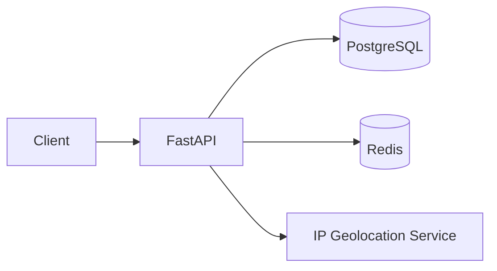

# LinkForge – URL Management & Analytics Platform

<div align="center">


A cloud-native backend platform for secure URL management, intelligent redirection, and real-time analytics built using FastAPI, PostgreSQL, Redis, and Docker.

[Features](#features) • [Architecture](#architecture) • [Quick Start](#quick-start) • [Configuration](#configuration) • [Docker](#docker) • [Testing](#testing)

</div>

---

# Features

## URL Management

- Generate unique short URLs
- Support custom aliases with validation
- URL expiration (TTL)
- QR code generation
- Bulk URL creation

## Intelligent Redirection

- Cache-first URL resolution using Redis
- Automatic database fallback
- Configurable cache expiration
- High-performance redirects

## Analytics

- Real-time click tracking
- Geographic location lookup
- Browser and operating system detection
- Device identification
- Referrer tracking
- Daily click statistics
- Most visited URLs

## Authentication

- JWT-based authentication
- Secure password hashing with bcrypt
- User-owned URL management
- Multi-user support

## Security

- Request validation
- Input sanitization
- Configurable rate limiting
- Secure API responses
- Structured error handling

## Engineering Features

- Redis caching
- Alembic database migrations
- Structured logging
- Docker containerization
- Environment-based configuration
- Modular FastAPI architecture
- RESTful API design

---

# Architecture



### Technology Stack

- **FastAPI** – REST API framework
- **SQLAlchemy + PostgreSQL** – Persistent storage
- **Redis** – URL caching and rate limiting
- **IP Geolocation Service** – Country and city resolution
- **Docker** – Containerized deployment

---

# Project Structure

```
app/
├── api/
├── core/
├── db/
├── schemas/
├── services/
└── main.py

alembic/
tests/
docker/
```

---

# Quick Start

## Clone the repository

```bash
git clone https://github.com/AadiBagde/LinkForge.git

cd LinkForge
```

## Create a virtual environment

```bash
python -m venv venv
```

Windows

```bash
venv\Scripts\activate
```

Linux/macOS

```bash
source venv/bin/activate
```

## Install dependencies

```bash
pip install -r requirements.txt
```

## Configure environment variables

```bash
cp .env.example .env
```

Update the values inside `.env` according to your local setup.

## Run the application

```bash
uvicorn app.main:app --reload
```

Swagger UI

```
http://localhost:8000/docs
```

ReDoc

```
http://localhost:8000/redoc
```

---

# Core Capabilities

| Feature | Description |
|----------|-------------|
| URL Shortening | Generate short URLs with custom aliases |
| Intelligent Redirection | Redis cache with PostgreSQL fallback |
| Analytics | Click tracking, location, browser, device, referrer |
| QR Codes | Generate downloadable QR codes |
| Authentication | JWT-based login and user management |
| Rate Limiting | Redis-backed per-IP rate limiting |
| Caching | Configurable Redis TTL |
| Logging | Structured application logging |
| Docker | Containerized deployment |

---

# Configuration

| Variable | Description |
|----------|-------------|
| DATABASE_URL | PostgreSQL connection string |
| REDIS_HOST | Redis host |
| REDIS_PORT | Redis port |
| BASE_URL | Base application URL |
| CACHE_EXPIRY | Redis cache TTL |
| MAX_REQUESTS_PER_MINUTE | Rate limit quota |
| RATE_LIMIT_WINDOW | Rate limit duration |
| LOG_LEVEL | Application logging level |

Copy

```bash
.env.example
```

to

```bash
.env
```

and update the values.

---

# Docker

Start the complete application stack

```bash
docker compose up -d
```

View logs

```bash
docker compose logs -f
```

Stop containers

```bash
docker compose down
```

---

# Testing

Run the test suite

```bash
pytest
```

Current tests cover:

- Authentication
- URL creation
- URL validation
- Request validation

---

# API Documentation

Once the application is running:

Swagger UI

```
http://localhost:8000/docs
```

ReDoc

```
http://localhost:8000/redoc
```

---

# Tech Stack

### Backend

- Python
- FastAPI
- SQLAlchemy

### Database

- PostgreSQL
- Redis

### Authentication

- JWT
- bcrypt

### DevOps

- Docker
- Alembic

### Utilities

- QR Code Generation
- Structured Logging
- IP Geolocation

---

# Future Improvements

- Custom domains
- Click heatmaps
- Scheduled link activation
- Webhook support
- Role-based administration
- Dashboard visualizations

---

# License

This project is licensed under the MIT License.

---

Built using FastAPI, PostgreSQL, Redis, and Docker.
