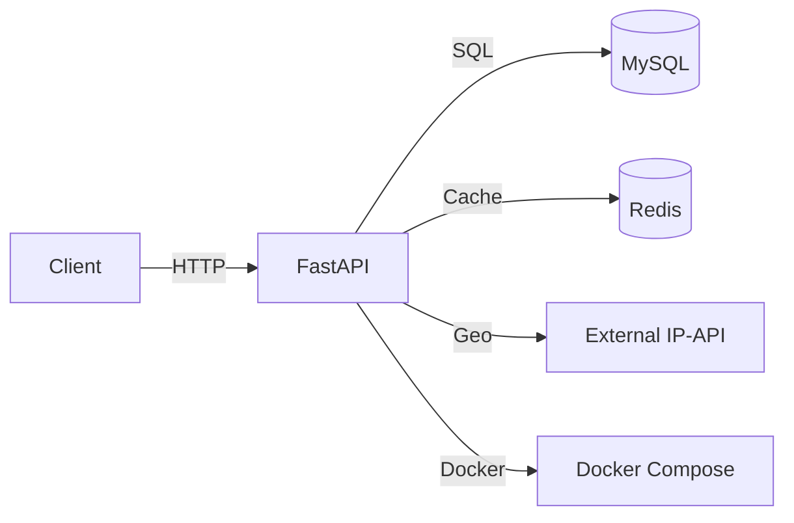

# LinkForge

**LinkForge** – an enterprise‑grade URL shortener, analytics, and link‑management platform built with **FastAPI**, **SQLAlchemy**, **MySQL**, and **Redis**.

---

## ✨ Overview

LinkForge provides a performant API to shorten URLs, generate QR codes, track click analytics (including geo‑location), enforce rate‑limiting, and cache short‑code lookups. It uses **deterministic Base62 encoding** of the database ID for short codes— a technique employed by many production services.

---

## 🗂️ Architecture



- **FastAPI** – main web framework
- **SQLAlchemy + MySQL** – persistence layer for URLs and click events
- **Redis** – short‑code cache (TTL‑based) and distributed rate‑limiter
- **External IP‑API** – resolves IP → country/city for geo analytics
- **Docker** – containerised development & deployment

---

## 🚀 Quick Start

1. **Clone the repo**
   ```bash
   git clone https://github.com/<YOUR_USERNAME>/LinkForge.git
   cd LinkForge
   ```

2. **Create a virtual environment & install dependencies**
   ```bash
   python -m venv venv
   source venv/bin/activate   # Windows: venv\Scripts\activate
   pip install -r requirements.txt
   ```

3. **Create a `.env` file** (copy from the example)
   ```bash
   cp .env.example .env
   # edit .env if you need custom DB credentials, Redis host, etc.
   ```

4. **Run the application**
   ```bash
   uvicorn app.main:app --reload
   ```
   API documentation is available at `http://localhost:8000/docs`.

5. **Health check**
   ```bash
   curl http://localhost:8000/health
   # => {"status":"ok"}
   ```

---

## 📦 Features

| Feature | Description |
|---------|-------------|
| **URL Shortening** | `POST /shorten` – custom short codes or auto‑generated Base62 IDs |
| **Redirect** | `GET /{short_code}` – 307 redirect with optional cache hit |
| **QR Code** | `GET /qr/{short_code}` – PNG QR image for the short URL |
| **Analytics** | Click tracking with timestamps, user‑agent, referrer, country & city |
| **Top URLs** | `GET /analytics/top` – returns most‑clicked short codes |
| **Rate Limiting** | Redis‑backed per‑IP limit (configurable via env) |
| **Caching** | Redis `SETEX` with configurable TTL (default 1 hour) |
| **Geo Enrichment** | Async IP → location lookup; failures are gracefully ignored |
| **Docker** | `docker compose up -d` builds and runs the full stack |
| **Health Endpoint** | `/health` – simple JSON status check |
| **Logging** | Centralised Python `logging` respecting `LOG_LEVEL` env var |

---

## 🛠️ Configuration (`.env`)

| Variable | Description | Default |
|----------|-------------|---------|
| `DATABASE_URL` | MySQL connection string (required) | – |
| `REDIS_HOST` | Redis host | `localhost` |
| `REDIS_PORT` | Redis port | `6379` |
| `BASE_URL` | Base URL used when constructing short URLs | `http://localhost:8000` |
| `MAX_REQUESTS_PER_MINUTE` | Rate‑limit quota per IP | `10` |
| `RATE_LIMIT_WINDOW` | Rate‑limit window in seconds | `60` |
| `CACHE_EXPIRY` | Redis cache TTL in seconds | `3600` |
| `LOG_LEVEL` | Logging level (`DEBUG`, `INFO`, `WARNING`, `ERROR`) | `INFO` |

Copy `.env.example` to `.env` and adjust values as needed.

---

## 🐳 Docker

The repository includes a `docker-compose.yml` that spins up three containers:

1. **app** – the FastAPI service (built from the Dockerfile)
2. **db** – MySQL
3. **redis** – Redis

```bash
docker compose up -d   # start everything
docker compose logs -f  # view logs
```

The **health endpoint** can be used to verify the container is up:
```bash
curl http://localhost:8000/health
```

---

## 📊 Testing (Tier 3)

A minimal pytest suite is recommended. Run:
```bash
pytest -q
```
Add tests for:
- URL creation (custom & auto‑generated)
- Cache hit/miss behaviour
- Rate‑limit enforcement
- Geo service error handling
- Health endpoint

---

## 📜 License

This project is released under the **MIT License** – see the `LICENSE` file for details.

---

## 🙋‍♀️ How to List on Your Résumé

```
LinkForge – Enterprise Link Management & Analytics Platform
 • Built with FastAPI, SQLAlchemy, MySQL, Redis, Docker
 • Implemented deterministic Base62 short‑code generation, TTL caching, distributed rate‑limiting, QR code generation, and geo‑enriched click analytics
 • Production‑ready configuration (env‑driven, health check, central logging)
```

---

### 🎉 Enjoy!
Feel free to open issues or submit pull requests – contributions are welcome.
